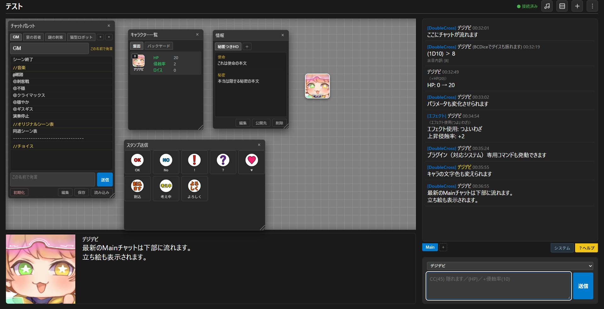

# もじゅらX

オンラインでテーブルトークRPGを遊ぶための道具です。ブラウザで部屋を開き、参加者同士で
盤面・チャット・ダイスを共有します。インストールも会員登録も要りません。

公開中のサービス: https://modurax.onrender.com/

> **オープンテスト中です。** 予告なく仕様が変わったり、データが消えたりすることがあります。



<sub>ダブルクロス3rdのプラグインを入れた部屋。ダイス・パラメータ増減・エフェクト使用・秘匿情報・スタンプ・立ち絵が同じ画面に乗っています。</sub>

## 設計の軸

本体（Core）は、コマ・パネル・チャット・シーン・バフ・ラウンド進行といった
**どのTRPGでも共通の器**だけを持っています。特技表や判定の作法といった
**システム固有の知識はすべてプラグインに閉じ込める**、というのがこの設計の唯一の約束です。

> Coreは値を運ぶが、意味は解釈しない。

そのため、Coreに手を入れずにファイルを1つ足すだけで新しいゲームシステムを追加できます
（[docs/plugin-guide.md](docs/plugin-guide.md)）。

## できること

| | |
|---|---|
| 盤面とコマ | コマの追加・移動、バックヤード（盤面からしまったコマの個人保管場所）、パネル、背景 |
| チャット | タブ、公開範囲の指定、発言の編集、読み物として読めるHTMLへの書き出し |
| ダイス | BCDiceの公開APIで判定。3Dダイスが転がる演出つき |
| チャットコマンド | パラメータ参照 `{HP}`、増減 `+侵蝕率(10)`、バフ付与、フェイズ終了、オリジナル表 |
| チャットパレット | ブラウザごとに定型文・コマンドを保存してボタンにする |
| カードとデッキ | デッキの作成・編集・盤面配置・ドロー。裏向きのカードを自分だけ確認できる |
| バフ／デバフ | コマへの付与と一覧。シナリオ／シーン／ラウンド／プロセス／判定の単位で自動消滅 |
| シーンと情報 | シーンの遷移、全員で見る共有メモ |
| ラウンド進行 | 参加者選択、状態バー、プロット（未公開の値は他人に配らない） |
| 音楽 | BGM・効果音・システム音。発言に反応して鳴らす「再生フレーズ」 |
| スタンプ | 押すとその場で送れる浮動パネル |
| キャラシ取り込み | 外部ツール（ゆとシート系など）のJSONやURLからコマを作る |
| コマ作成ツール | 部屋を作らずにコマだけ作って書き出す独立ページ |
| PWA | ホーム画面・デスクトップへインストールできる |

対応済みのプラグイン: ダブルクロス3rd / シノビガミ / 銀剣のステラナイツ /
アリアンロッド2E / ドラクルージュ / フタリソウサ / グランクレスト戦記RPG

## 動かす

```bash
npm install
npm run dev
```

`http://localhost:8082` を開けば動きます。**`.env` は要りません。**
Upstash も R2 も未設定なら、部屋のデータは `server/rooms/*.json` に平文で落ちます
（`npm run dev` で中身を目で読めることに価値があるので、あえて平文のままにしています）。

本番相当で動かすときは `npm start`（ポート8081）。こちらは `.env` を読みます。

### `npm run dev` と `npm start` を分けてある理由

`npm start` は `.env` を読むので、Upstashの接続情報が入っていると**本番と同じデータを
読み書きします**。検証のつもりで起動したサーバーが本番の部屋を書き換える事故が実際に
起きたため、`npm run dev`（`server/dev-local.js`）は環境に残っている本番のキーを
明示的に消してから本体を読み込みます。ポートも 8081 / 8082 とずらしてあります。

**検証は必ず `npm run dev` で行ってください。**

### 必要なもの

- Node.js **18以上**（`aws4fetch` がNode標準の `fetch` に乗っているため）
- 本番として動かすなら Upstash Redis と Cloudflare R2。設定する変数は
  [.env.example](.env.example) にすべて名前と役割を書いてあります

## 構成

ビルド工程はありません。`js/` の `.js` がそのままブラウザへ配信されます
（素のES Modules、フレームワークなし）。

| | |
|---|---|
| `js/` | クライアント側の全ロジック |
| `js/store/` | 部屋の状態遷移。`handlers/` にアクション別の処理、直下にその道具 |
| `js/parameters/` | ゲームシステムごとのプラグインと、その共通フレームワーク |
| `js/help/` | 部屋の中の「？ヘルプ」の文章と描画 |
| `css/` | 色と書体のトークン（`tokens.css`）と、ページごとのスタイル |
| `server/` | 静的配信・WebSocket同期・各種APIを1プロセスで受け持つ |
| `vendor/` | 外部ライブラリの実体（3Dダイス） |
| `image/` `background/` | アイコン、スタンプ、カード、背景の置き場 |
| `docs/` | プラグインガイドと、自動生成のコードマップ |

画面になるHTML:

| | |
|---|---|
| `index.html` | 部屋一覧。部屋を探して入る／新しく作る |
| `combined_layout.html` | 盤面本体。`?room=room-XXXX` で開く |
| `character-builder.html` | コマ作成ツール |
| `about.html` | 利用規約・プライバシーポリシー・免責事項・連絡先 |
| `release-notes.html` | 更新の記録 |
| `offline.html` | 通信が死んでいるときにService Workerが返す控えのページ |

## 仕組みの要点

**全部屋を1プロセスで受け持ちます。** どこか1か所の取りこぼしでプロセスが落ちると、
無関係な部屋のセッションまで一斉に切断されます。上限やレート制限が多いのはそのためです。

**同期はサーバー権威です。** 部屋の状態は1つのイミュータブルな木で、
`dispatch(action, payload)` でしか変わりません。**同じ `js/game-store.js` を
ブラウザとサーバーの両方が動かします。** ブラウザが dispatch して自分の画面に先に反映し、
WebSocketで送り、サーバーが同じreducerを適用して保存し、全員へ配り直します。

**静的配信は許可リスト方式です。** リポジトリのルートには配ってはいけないものが
ブラウザ向けのファイルと同居しているので、「配ってよいものだけを挙げる」形にして
既定を塞ぐ側へ倒しています。許可外は403ではなく404で揃えます（存在を知らせないため）。

**部屋は最終更新から14日で自動削除されます。**

## 守っているもの・守っていないもの

ここは正直に書いておきます。

**守る対象は3つです。** ①サーバー本体（秘密の漏洩・プロセスの停止）②金銭と資源
（R2・Upstash・ホスティングの課金）③他の利用者のブラウザ（保存型XSS）。

**なりすましと秘匿データの覗き見は、意図的に守っていません。**
会員登録もログインもなく、本人確認の種は「表示名」だけです。表示名は全員に見えるので、
名前を知っていれば誰でも同じ参加者として名乗れます。GMになりすませること自体が仕様です。

同じ理由で、**部屋のデータは「限定公開」にした内容も含めて参加者全員のブラウザへ
配られています。** 画面に出さないようにしているだけです。本当に人に見せられない情報は
書かないでください。入室パスワードも、仲間内で部屋を仕切るための鍵であって、
強固な秘匿の保証ではありません。

## 開発するときに

コメントには「どうするか」ではなく**「なぜそうしたか」**を書いています。
特に「〜という事故が実際に起きたため」という失敗の記録が随所にあります。
消さずに育ててください。

- 依存は増やさない方針です（本番依存は5つ）
- 状態はイミュータブル。変化が無ければ同じ参照を返す（差分検知に使っています）
- `eval` / `new Function` は使いません
- 外部由来のJSONは必ず `js/untrusted-json.js` の `parseUntrustedJson` を通します
- 本番はLinuxでファイル名の大文字小文字を区別します。手元では正しく見えて本番だけ
  画像が出ない、という事故が起きます
- [docs/codemap/](docs/codemap/) はソースを読まずに構造を把握するためのインデックスです。
  自動生成なので、表を手で直しても次回の生成で消えます
- **[docs/change-checklist.md](docs/change-checklist.md)** に、直したり機能を足したりした
  ときに一緒に直す場所をまとめてあります。プラグインを足すと権利表示が3か所必要、
  環境変数を足すと `dev-local.js` にも要る、といった忘れやすいものです

自動テストはありません。確かめ方は [docs/plugin-guide.md](docs/plugin-guide.md) の
「動作確認のしかた」にあります。

## 不具合の報告

Issue でお知らせください。再現手順・使ったブラウザ・部屋の状況があると助かります。

**プルリクエストは、予告なしのものは受け付けていません。**
オープンテスト中で作者の手が動いている最中のため、行き違いになりやすいからです。
直したいところがある場合は、まず Issue で相談してください。

サービスの利用についての問い合わせは
[このサービスについて](https://modurax.onrender.com/about.html) の連絡先へどうぞ。

## ライセンス

[MIT License](LICENSE) — Copyright (c) 2026 ねこまる

ただし**以下の3つはMITの対象外**です。作者が権利を持っていないため、
第三者へ自由な利用を許諾できません。詳しくは [NOTICE](NOTICE) を参照してください。

1. **`js/parameters/` の表データ** — 特技表・感情表・絆・「道」など。これらは
   [BCDice](https://github.com/bcdice/BCDice)（BSD-3-Clause）から取っていますが、
   表そのものの権利は各作品の著作者・出版元にあります。もじゅらXは
   [二次創作活動のガイドライン](https://www.arclight.co.jp/trpg-rights/)（アークライト
   ほか6社合同）に従います。出所の対応表と権利表示は [NOTICE](NOTICE) にあります。
2. **ロゴとそこから派生したアイコン6ファイル** — 著作権は原作者に帰属します。
   もじゅらXは使用許諾を得ているだけです。フォークして別のサービスとして公開する
   場合は差し替えてください。
3. **`vendor/` のライブラリ** — それぞれのライセンスに従います。

**権利者の方へ** — もじゅらXは各作品の二次創作活動のガイドラインに従って運営しています。
本作の内容について、権利を有する方からお申し出があった場合は、速やかに該当部分を削除
または修正します。連絡先は[このサービスについて](https://modurax.onrender.com/about.html)
にあります。

ダイスの判定には外部の [BCDice](https://bcdice.onlinesession.app) の公開APIを
使っています。BCDice本体のコードは含んでいません。
